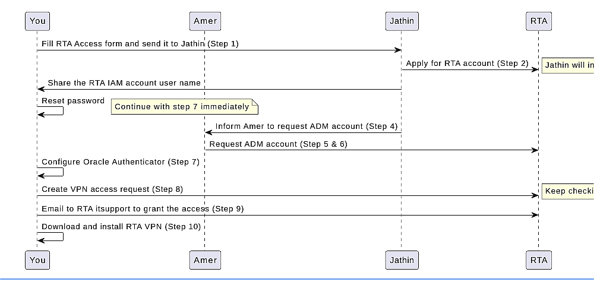

# New user onboarding

This page contains the onboarding pieces used by the RTA Wizard. Each `wizard:` block maps to one wizard step so admin-owned steps do not show the full end-to-end user checklist.

<!-- wizard:form -->
## Access form

Complete the official RTA new-user access form before the RTA account can be requested.

1. Fill the yellow boxes in the **RTA_NEW User Form - AVM Amer Darwich.xlsx**.
2. Upload the filled form to the required location, if applicable.
3. Send the completed form to Jathin.
4. Attach the filled form.
5. Add your signature or name at the end of the email.
6. Make sure the employee ID copy in PDF is available for the request package.

<!-- /wizard -->

<!-- wizard:account_creation -->
## RTA account creation

This is an admin-owned waiting step.

1. Jathin applies for your RTA account in the RTA system.
2. You do not need to request an OTP or take action during this step.
3. Wait until Jathin confirms that the RTA account has been created.
4. The expected username format is `IITS_*USERNAME*`.

After Jathin shares the username, continue to **Save Your IITS Username** in the wizard.
<!-- /wizard -->

<!-- wizard:save_iits -->
## Save the IITS username

After Jathin confirms the RTA account, save the `IITS_*USERNAME*` value in the wizard.

Use the IITS username for:

- RTA password reset
- Oracle Authenticator setup
- RTA VPN login
- PAM and SFTP-related access workflows

Do not save passwords in the portal. Save only the username.
<!-- /wizard -->

<!-- wizard:adm_request -->
## ADM account and PAM onboarding

This is an admin-owned waiting step.

1. Jathin informs Amer to request the ADM account.
2. The PAM onboard list is updated and routed for approval.
3. Mustafa approves the request.
4. ITD and SMD approvals are completed.
5. Amer sends the PAM account creation request with the approval email attached.

You only need to wait until Amer confirms that the ADM account / PAM onboarding path is ready.
<!-- /wizard -->

<!-- wizard:save_adm -->
## Save the ADM username

After Amer confirms the ADM account, save the ADM username in the wizard.

Use the ADM username for PAM and privileged server-access workflows.

Do not save passwords in the portal. Save only the username.
<!-- /wizard -->
