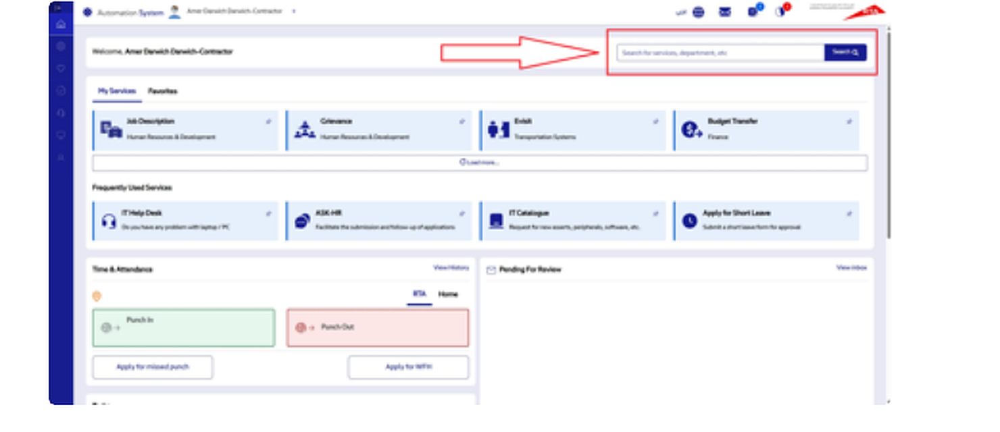
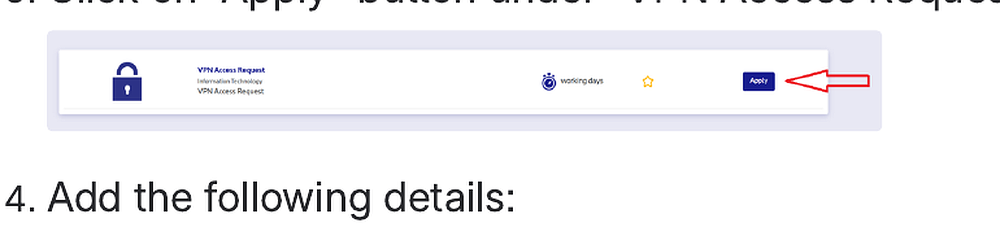
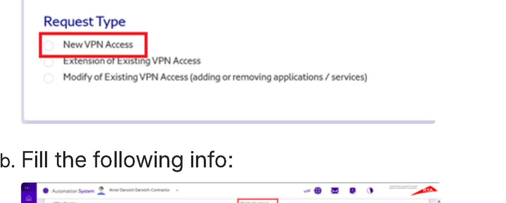
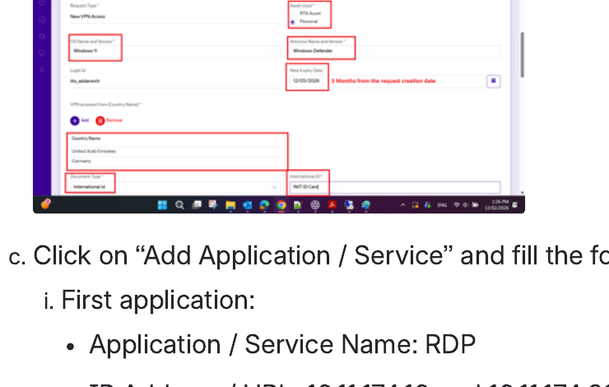
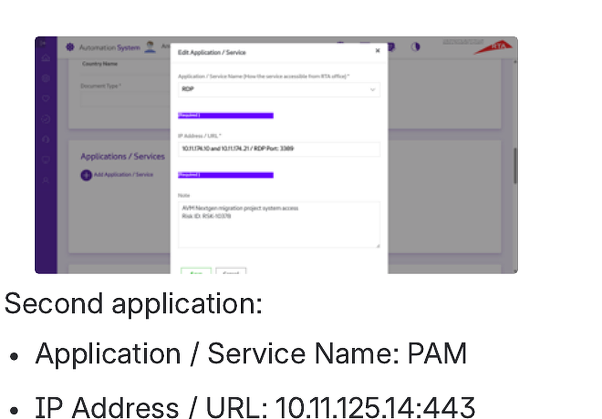
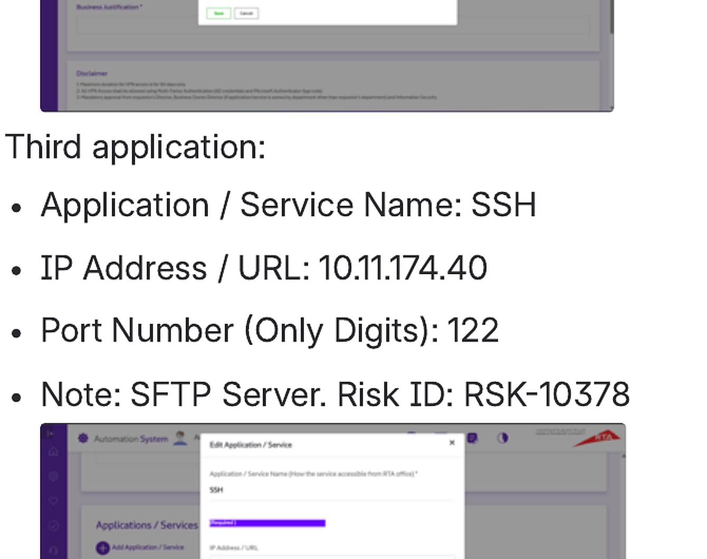

# Request access for RDP, SFTP and PAM

<!-- wizard:vpn_request -->
## Portal path

1. Log in to the **RTA Automation Portal**.
2. Type **VPN** in the search box and click **Search**.
3. Click **Apply** under **VPN Access Request**.
4. Choose **New VPN Access**.
5. Fill in the required form fields.
6. Add the required applications and services.
7. Attach a copy of your INIT ID card.
8. Submit the request and note the request ID.

<!-- /wizard -->

<!-- wizard:vpn_request -->
## Applications to request

Add these application/service entries to the VPN access request.

### RDP

- Application / Service Name: `RDP`
- IP Address / URL: `10.11.174.10` and `10.11.174.21`
- RDP Port: `3389`
- Note: `AVM Nextgen migration project system access. Risk ID: RSP-10378`

### PAM

- Application / Service Name: `PAM`
- IP Address / URL: `10.11.125.14:443`
- Port Number: leave blank

### SSH / SFTP

- Application / Service Name: `SSH`
- IP Address / URL: `10.11.174.40`
- Port Number: `122`
- Note: `SFTP Server. Risk ID: RSK-10378`

<!-- /wizard -->
