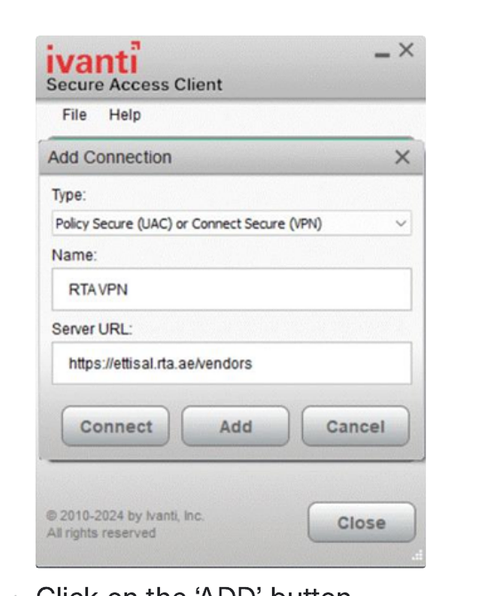

# Download and install RTA VPN (Ivanti Secure Access Client)

## Steps

1. Download and install the Ivanti VPN client.
2. Open Ivanti Secure Access Client.
3. Click the **+** icon.
4. Enter:
   - Type: `Policy Secure (UAC)` or `Connect Secure (VPN)`
   - Name: `RTA VPN`
   - Server URL: `https://ettisal.rta.ae/vendors`
5. Click **Add**.
6. To connect, click **Connect**.

## Authentication

The RTA VPN uses multi-factor authentication:
- First factor: your RTA account `IITS_*USERNAME*` and password
- Second factor: the 6-digit TOTP configured in Oracle Authenticator

## Screenshot

