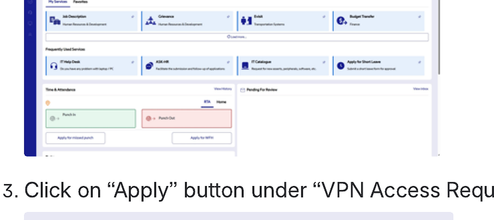
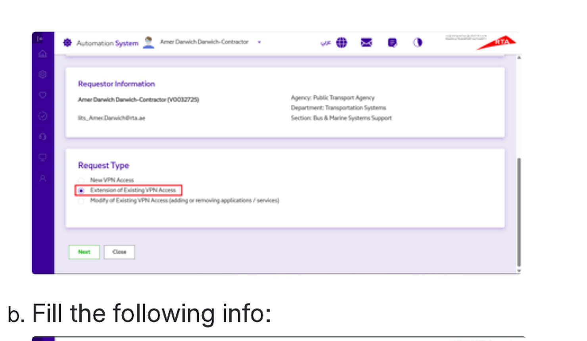
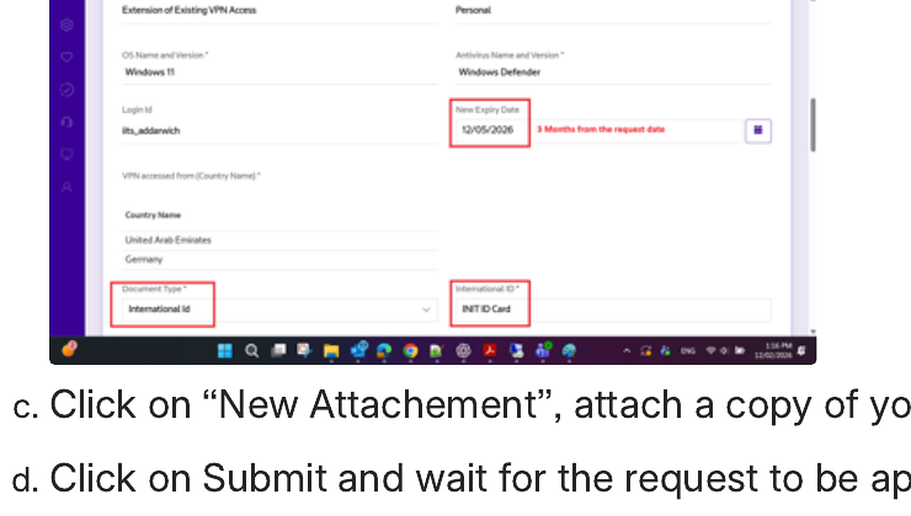

# Renew access for RDP, SFTP and PAM

<!-- wizard:vpn_request install_vpn -->
## Renewal path

Use this renewal path when existing VPN / RDP / SFTP / PAM access is close to expiry.

1. Log in to the **RTA Automation Portal**.
2. Type **VPN** in the search box and click **Search**.
3. Click **Apply** under **VPN Access Request**.
4. Choose **Extension of Existing VPN Access**.
5. Fill in the required renewal details.
6. Attach a copy of your INIT ID card.
7. Click **Submit** and wait for approval.

VPN access, including RDP, SFTP, and PAM, expires after 90 days. The system may not send reminders, so renew in time.

<!-- /wizard -->
