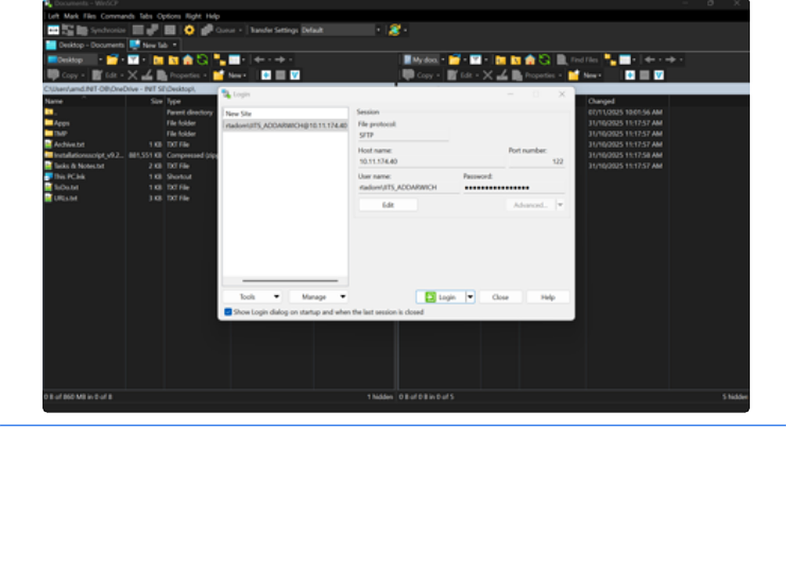

# Download and install WinSCP

<!-- wizard:install_vpn -->
## WinSCP / SFTP setup

Use WinSCP after VPN access is approved and connected.

1. Download and install the WinSCP tool.
2. Open WinSCP.
3. Fill in the connection details:
   - File protocol: `SFTP`
   - Hostname: `10.11.174.40`
   - Port: `122`
   - Username: `rtadom\IITS_*USERNAME*`
   - Password: your RTA account password

<!-- /wizard -->
