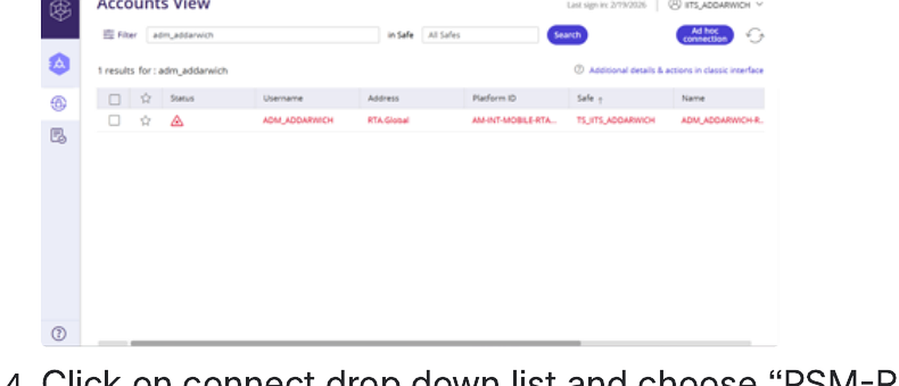
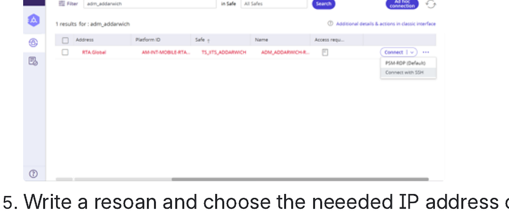

# How to use PAM

<!-- wizard:install_vpn -->
## PAM access test

Use PAM after VPN access and Oracle Authenticator are working.

1. Connect to the RTA VPN.
2. Open the PAM URL.
3. Enter your credentials:
   - `rtadom\IITS_*USERNAME*`
   - the 6-digit TOTP from Oracle Authenticator
4. Search for your RTA account.
5. Open the **Connect** dropdown and choose **PSM-RDP**.
6. Enter a reason.
7. Choose the required server IP address.

<!-- /wizard -->
