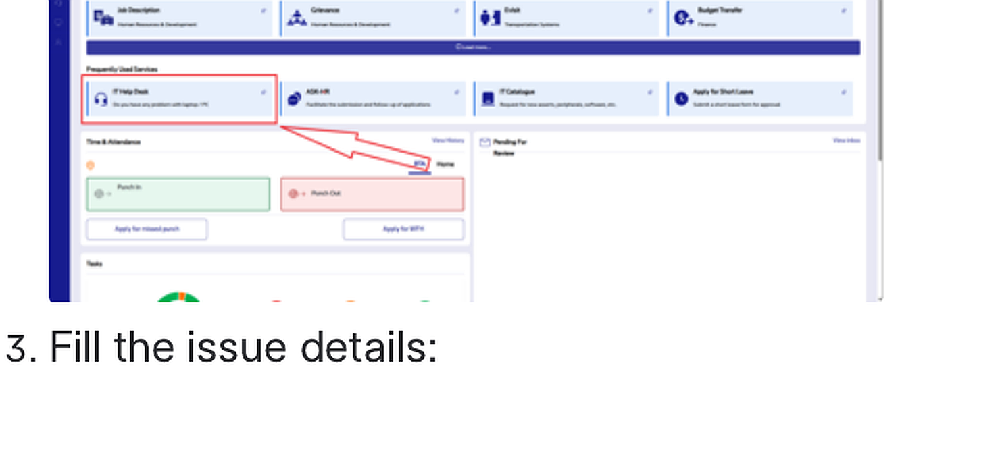

# Create a ticket for RTA IT Support

<!-- wizard:email_support -->
## Access-grant email and support ticket

After the VPN access request has been approved and closed, send the access-grant email to the RTA IT Support team.

Include:

1. The VPN access request ID.
2. Your signature or name at the end of the email.
3. Any screenshots or details needed to confirm the request.

Use the RTA Automation Portal **IT Help Desk** path if access is not working, approvals are blocked, or VPN / PAM / SFTP access behaves unexpectedly.

<!-- /wizard -->
