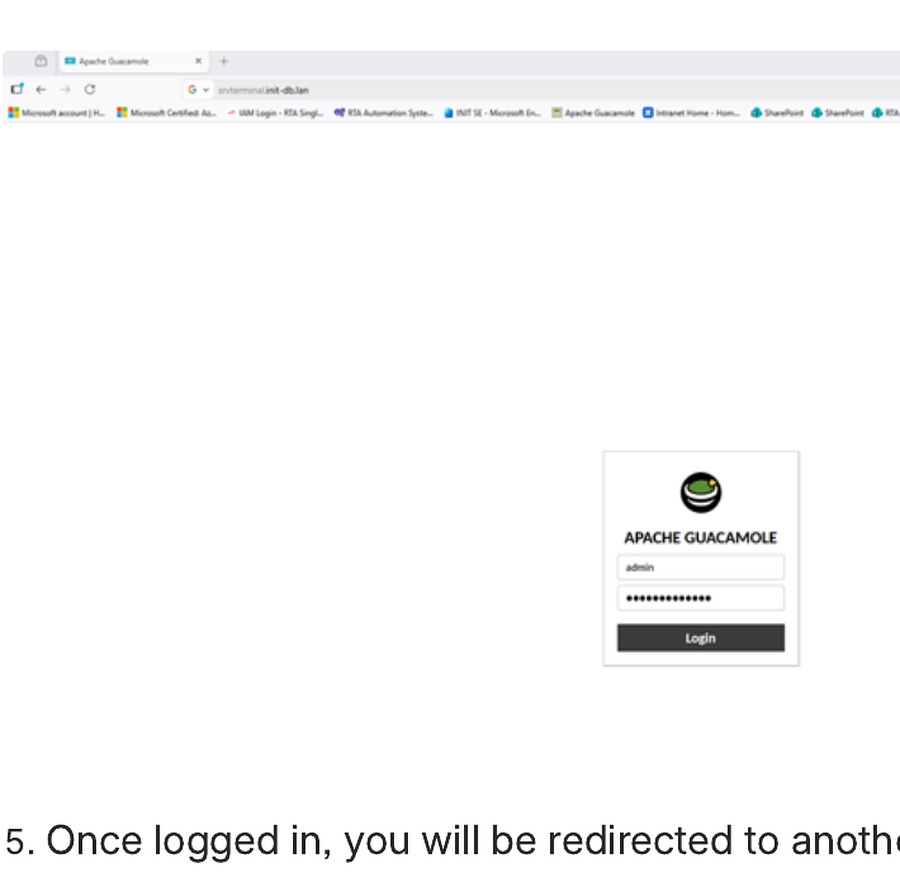
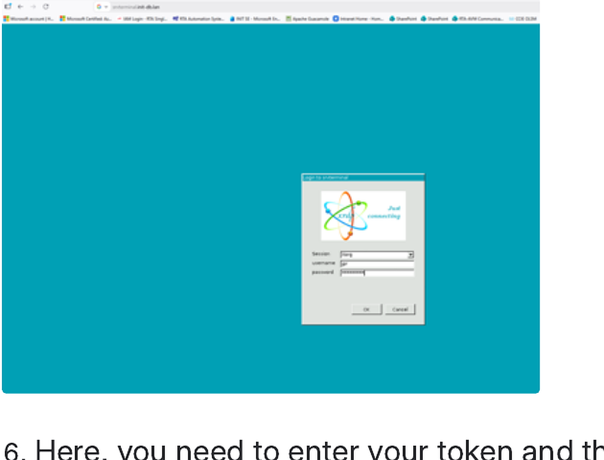
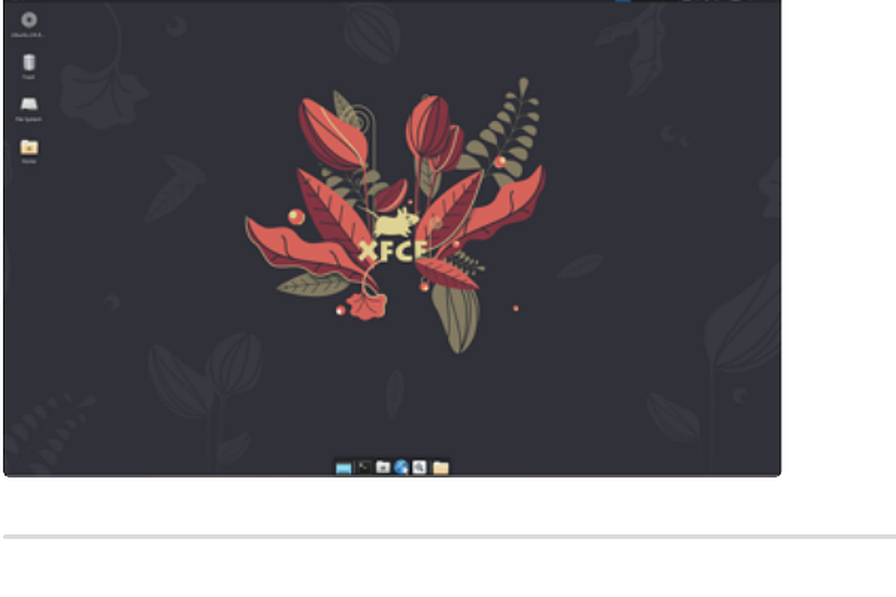
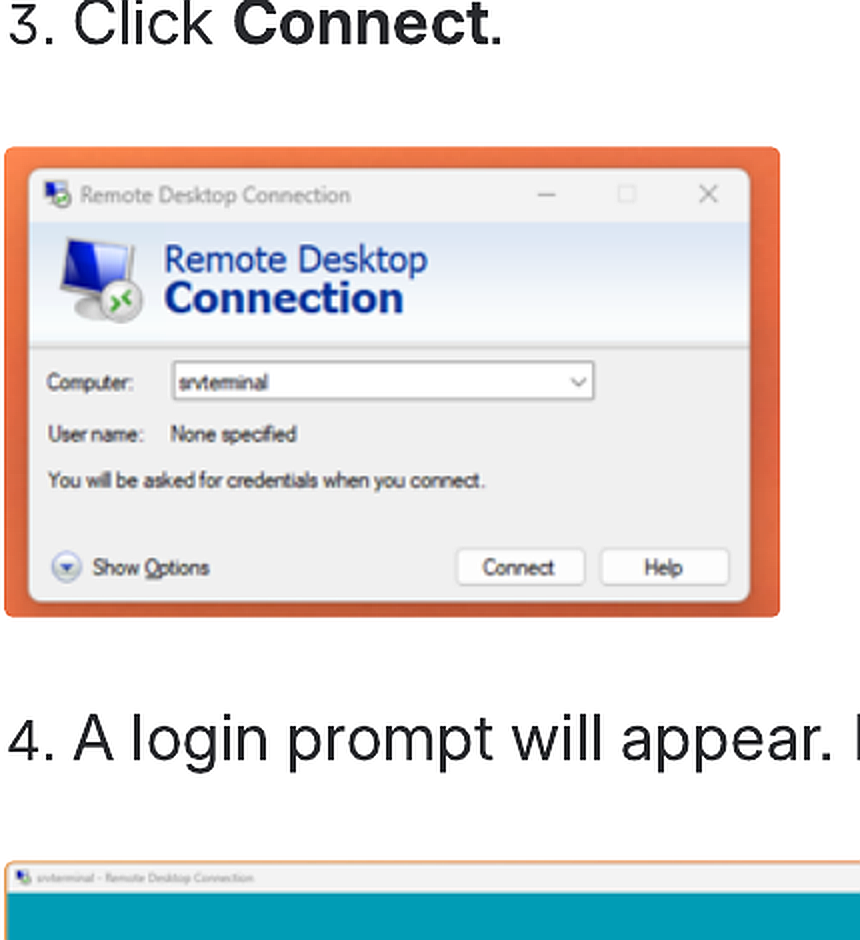
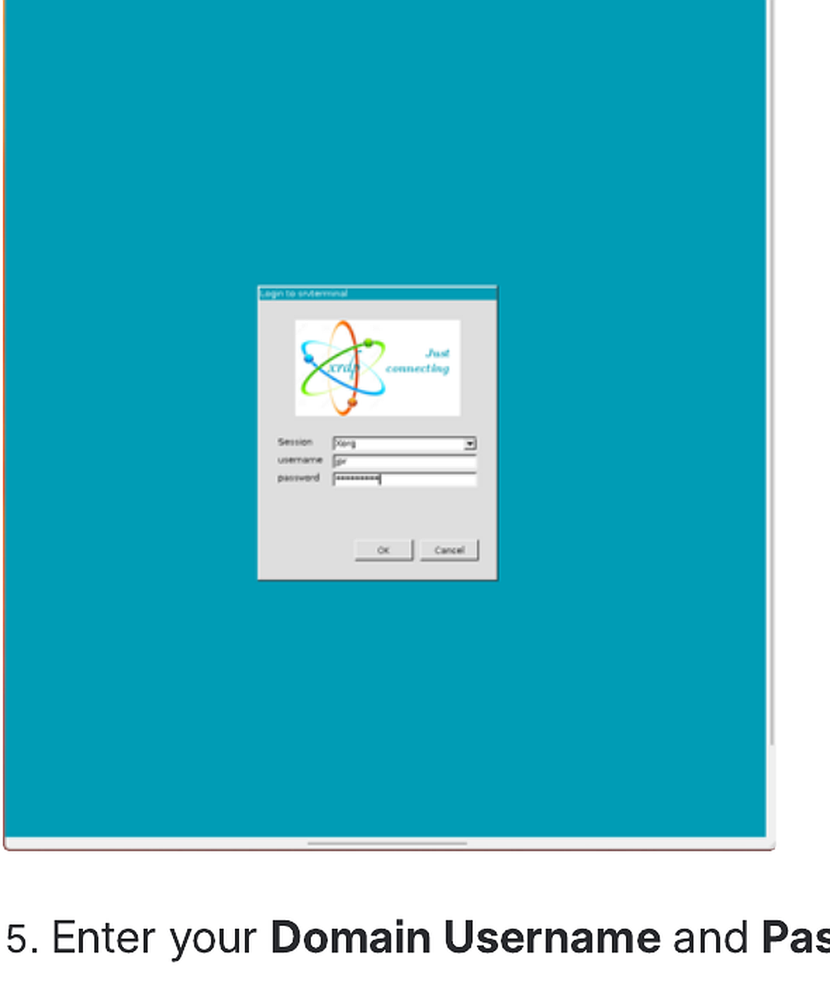
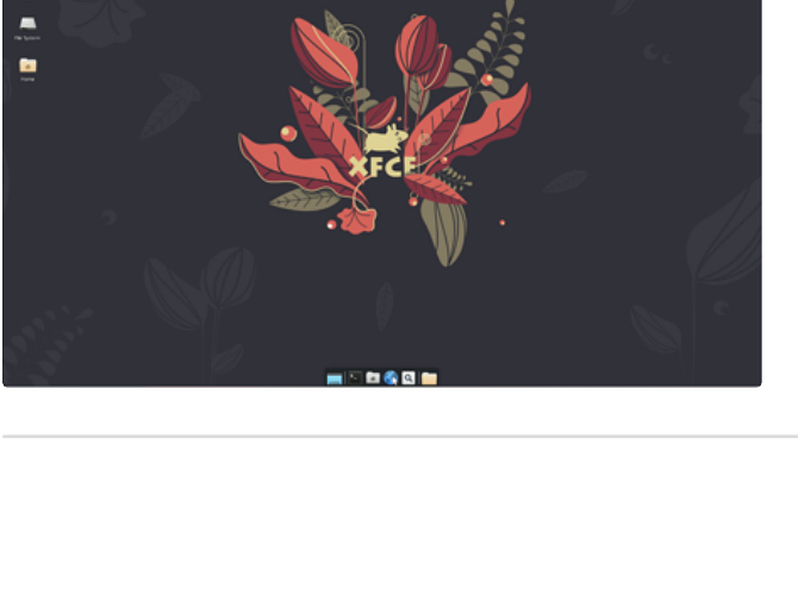

# User Manual: Terminal Server Access Guide

System: Ubuntu Terminal Server (`srvterminal`)  
Internal IP: `172.31.10.82`

## Method 1: Web browser access (recommended)

1. Open a browser.
2. Go to `https://srvterminal.init-db.lan`.
3. If you see the browser security warning, continue to the site.
4. At the first login screen, use the local account:
   - Username: `admin`
   - Password: `adminINIT+971`
5. After login, you will be redirected to the RDP login page.
6. Enter your token and your Active Directory credentials, for example `INIT\ABC`.
7. The Ubuntu desktop opens directly in the browser.

## Method 2: Standard Windows RDP

1. Open **Remote Desktop Connection** in Windows.
2. In the **Computer** field, enter `172.31.10.82` or `srvterminal`.
3. Click **Connect**.
4. Ensure the session is set to **Xorg**.
5. Enter your domain username and password.
6. Click **OK**.

## Browser access screenshots

## Standard Windows RDP screenshots

